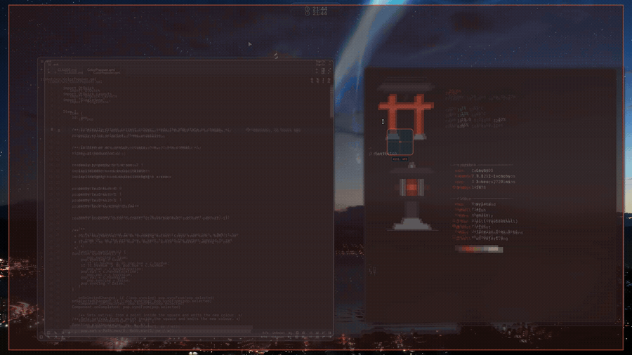

<div align="center">


# rishot

**Screenshot and annotate, on Wayland**

[](LICENSE)
&nbsp;
&nbsp;

</div>

<div align="center">



</div>

Drag a region, click a window, or grab a whole monitor. Mark it up, then copy, save, or upload. rishot started as the screenshot surface in my Hyprland rice, [Ricelin](https://github.com/Gakuseei/Ricelin), and now stands on its own.

## Install

```sh
curl -fsSL https://raw.githubusercontent.com/Gakuseei/rishot/main/install.sh | sh
```

Bind a key (see [Keybinding](#keybinding)) and run `rishot`. The installer pulls deps through your package manager and never touches your compositor config.

<details><summary>Other ways to install</summary>

Inspect before you pipe:

```sh
curl -fsSL https://raw.githubusercontent.com/Gakuseei/rishot/main/install.sh -o install.sh
less install.sh
sh install.sh
```

From a checkout:

```sh
git clone https://github.com/Gakuseei/rishot.git
cd rishot
bin/rishot
```

Quickshell is in the official repos on Arch (extra), Fedora 44+, Void, and Debian sid / Ubuntu 26.10. Older Fedora pulls it from the `errornointernet/quickshell` COPR, which a Qt version mismatch can sometimes break. `bin/rishot` finds its `src/` via `$RISHOT_CONFIG_DIR`, then `~/.local/share/rishot/src`, `/usr/share/rishot/src`, `/usr/lib/rishot/src`, then `../src`.

</details>

## Features

- Region, window, and monitor capture
- Resize the selection after the fact with eight handles
- Twelve tools: rectangle, ellipse, line, arrow, pen, highlighter, text, numbered steps, blur, pixelate, zoom
- Per-tool memory: every tool keeps its own colour and width
- Undo and redo, copy, save, upload
- Settings panel: pixelate coarseness, blur strength, zoom factor, key rebind

## Compositors

|  | Capture | Region + monitor | Window-click |
| --- | --- | --- | --- |
| Hyprland | yes | yes | yes |
| Sway | yes | yes | yes |
| Niri | yes | yes | yes |
| Wayfire / COSMIC / river | yes | yes | region + monitor only |

Capture works on any wlroots or `ext-image-copy` compositor. Window-click (grab just one window's frame) ships for Hyprland, Sway and Niri; everywhere else falls back to region and monitor.

## Keybinding

rishot does not grab a global hotkey. Bind it yourself:

```sh
bind = , Print, exec, rishot                       # Hyprland (conf)
hl.bind("Print", hl.dsp.exec_cmd("rishot"))        # Hyprland (lua)
bindsym Print exec rishot                          # Sway
```

Run `rishot` for region or window, `rishot monitor` for a whole output.

<details><summary>Dependencies</summary>

Required: `quickshell` (the `qs` binary), Qt 6 (declarative, svg, 5compat, wayland), `wl-clipboard`.

Optional: `imagemagick` (multi-monitor stitch), `cliphist` (clip history), `curl` (upload), `kdialog` (save dialog).

</details>

<details><summary>Environment variables</summary>

- `RISHOT_CONFIG_DIR` — the Quickshell config dir (the one holding `shell.qml`)
- `RISHOT_SAVEDIR` — the auto-save directory
- `RISHOT_UPLOAD` — the upload endpoint (curl form-post target)
- `RISHOT_KEYBIND_FILE` — a file rishot writes when you rebind from the settings panel

Rebinding from the settings panel on Hyprland writes a matching conf or lua line into its own include file, never your main config.

</details>

<details><summary>Upload</summary>

Upload posts to `litterbox.catbox.moe` by default. The link it returns is unguessable but **public**, and it expires after 72 hours. Set `RISHOT_UPLOAD` to use your own host. For anything sensitive, copy or save instead.

</details>

<details><summary>Notes</summary>

Toolbar icon centring needs Qt 6.10 or newer. On older Qt the icons box-centre, a touch off, but everything works.

</details>

---

<div align="center">
MIT &nbsp;·&nbsp; built with <a href="https://quickshell.outfoxxed.me/">Quickshell</a> &nbsp;·&nbsp; from <a href="https://github.com/Gakuseei/Ricelin">Ricelin</a>
</div>
